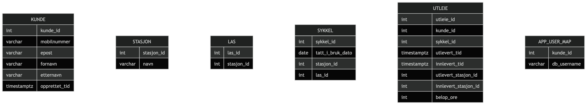
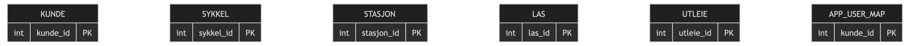
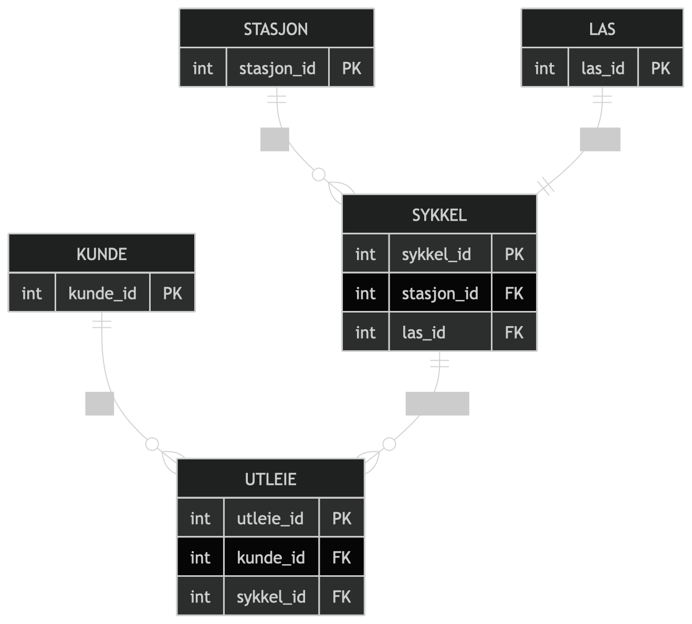
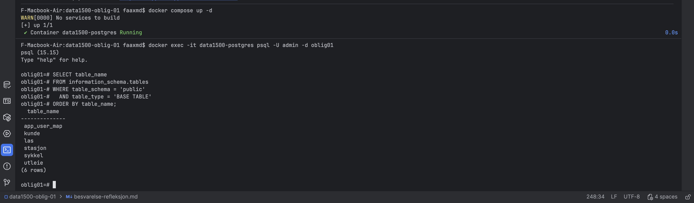
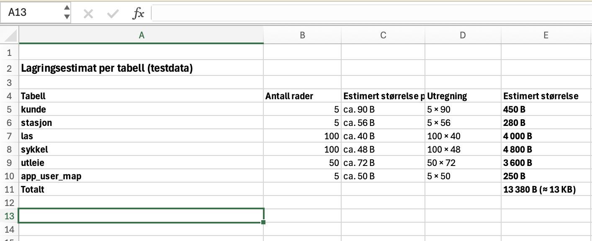
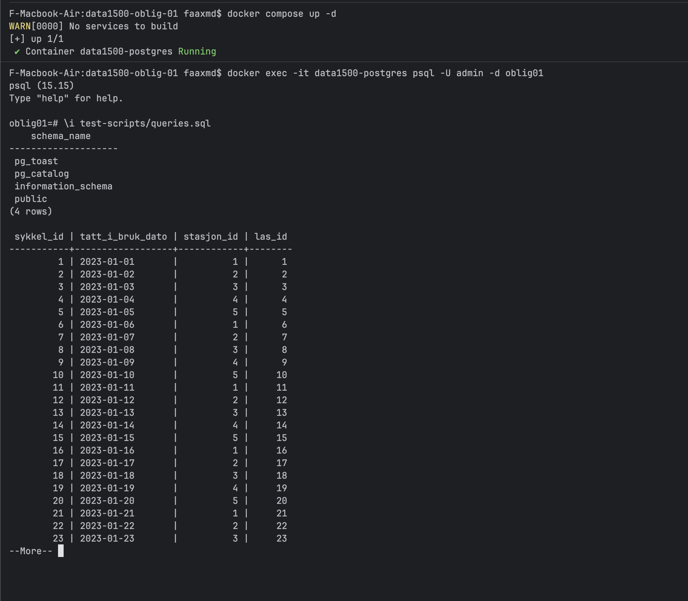

# Besvarelse - Refleksjon og Analyse

**Student:** Fathi Ahmed 

**Studentnummer:** S355502

**Dato:** 1. Mars 2026

---

## Del 1: Datamodellering

### Oppgave 1.1: Entiteter og attributter

**Identifiserte entiteter:**

- kunde 
- stasjon 
- las 
- sykkel 
- utleie 
- app_user_map (kobling mellom DB-bruker og kunde for autorisasjon)

**Attributter for hver entitet:**

Kunde
  - kunde_id 
  - mobilnummer 
  - epost 
  - fornavn 
  - etternavn 
  - opprettet_tid
  
Stasjon 
  - stasjon_id 
  - navn
  
Las 
- las_id 
- stasjon_id
 
Sykkel 
- sykkel_id 
- tatt_i_bruk_dato 
- stasjon_id (NULL når utleid)
- las_id (NULL når utleid)

Utleie 
- utleie_id 
- kunde_id 
- sykkel_id 
- utlevert_tid 
- innlevert_tid (NULL når ikke levert)
- utlevert_stasjon_id 
- innlevert_stasjon_id (NULL når ikke levert)
- belop_ore
  
App_user_map 
- kunde_id 
- db_username


---

### Oppgave 1.2: Datatyper og `CHECK`-constraints

**Valgte datatyper og begrunnelser:**

- kunde_id, stasjon_id, las_id, sykkel_id, utleie_id (INTEGER)

Disse brukes som primær- og fremmednøkler og gir effektiv lagring og raske join-operasjoner.

- fornavn, etternavn (VARCHAR / TEXT)

Navn varierer i lengde og lagres derfor som tekst uten fast lengdebegrensning.

- epost (VARCHAR / TEXT)

E-postadresser har varierende lengde og format, og lagres som tekst for fleksibilitet.

- mobilnummer (VARCHAR(8) / TEXT)

Mobilnummer behandles som tekst for å bevare ledende nuller og forenkle validering.

- navn i stasjon (VARCHAR)

Stasjonsnavn er tekstbaserte og lagres som tekstfelt.

- tatt_i_bruk_dato (DATE)

Feltet representerer kun dato, ikke klokkeslett, og lagres derfor som DATE.

- utlevert_tid, innlevert_tid, opprettet_tid (TIMESTAMPTZ)

Tidspunkter lagres med tidssone for å sikre korrekt håndtering av tidspunkt uavhengig av lokasjon.

- belop_ore (INTEGER)

Beløp lagres i øre for å unngå avrundingsfeil som kan oppstå med desimaltall.

- db_username (VARCHAR)

Databasenavn på brukere lagres som tekst og må være unikt for å sikre korrekt autorisasjon.

**`CHECK`-constraints:**
- Mobilnummer må bestå av nøyaktig 8 sifre

Dette sikrer at kun gyldige norske mobilnumre kan lagres i databasen.

- E-post må inneholde @ og . etter @

En enkel formatkontroll forhindrer åpenbart ugyldige e-postadresser.

- Beløp kan ikke være negativt (belop_ore >= 0)

Dette hindrer lagring av ugyldige eller logisk feilaktige betalingsbeløp.


**ER-diagram:**

---

### Oppgave 1.3: Primærnøkler

**Valgte primærnøkler og begrunnelser:**

- Kunde (kunde_id) brukes som primærnøkkel fordi den identifiserer hver kunde entydig.

- Stasjon(stasjon_id) brukes som primærnøkkel fordi hver stasjon må kunne skilles fra andre stasjoner.

- Lås(las_id) brukes som primærnøkkel fordi hver lås er unik.

- Sykkel(sykkel_id) brukes som primærnøkkel fordi hver sykkel må kunne identifiseres separat.

- Utleie(utleie_id) brukes som primærnøkkel fordi hver utleie er en egen hendelse som må kunne skilles fra andre utleier.

- App_user_map(kunde_id) brukes som primærnøkkel fordi hver kunde kun skal ha én tilknytning til et databasenavn.

**Naturlige vs. surrogatnøkler:**

Jeg har valgt å bruke surrogatnøkler (*_id) som primærnøkler.
Dette gir stabile og sikre nøkler som ikke endres over tid.

Mobilnummer og e-post kunne vært naturlige primærnøkler.
Disse kan imidlertid endres, for eksempel hvis en kunde bytter nummer eller e-post.
Dette kan føre til problemer ved oppdatering av data.
Derfor er de ikke valgt som primærnøkler.

**Oppdatert ER-diagram:**


---

### Oppgave 1.4: Forhold og fremmednøkler

**Identifiserte forhold og kardinalitet:**

- Kunde (1) → Utleie (mange)

- Sykkel (1) → Utleie (mange)

- Stasjon (1) → Lås (mange)

- Stasjon (1) → Sykkel (mange) (sykler står på stasjon når ikke utleid)

- Lås (1) → Sykkel (0/1) (en sykkel kan være låst i en lås; NULL når utleid)

- Utleie har én utleveringsstasjon, og (0/1) innleveringsstasjon (NULL når aktiv utleie)

- Kunde (1) → App_user_map (1) (én DB-bruker map per kunde)

**Fremmednøkler:**

- utleie.kunde_id → kunde.kunde_id

- utleie.sykkel_id → sykkel.sykkel_id

- utleie.utlevert_stasjon_id → stasjon.stasjon_id

- utleie.innlevert_stasjon_id → stasjon.stasjon_id (nullable)

- las.stasjon_id → stasjon.stasjon_id

- sykkel.stasjon_id → stasjon.stasjon_id (nullable)

- sykkel.las_id → las.las_id (nullable)

- app_user_map.kunde_id → kunde.kunde_id

- app_user_map.db_username er UNIQUE for å sikre én kobling per DB-bruker.

**Oppdatert ER-diagram:**



---

### Oppgave 1.5: Normalisering

**Vurdering av 1. normalform (1NF):**

- Alle tabeller har atomiske verdier (ingen lister i ett felt), og hver rad er entydig identifisert med PK. Derfor er modellen i 1NF.

**Vurdering av 2. normalform (2NF):**

- Tabellene har enten én-attributt PK eller en klar nøkkel (kunde_id i app_user_map). Ingen ikke-nøkkelattributter er delvis avhengig av en sammensatt PK. Derfor er modellen i 2NF.

**Vurdering av 3. normalform (3NF):**
- Ikke-nøkkelattributter er kun avhengige av primærnøkkelen i hver tabell.

- Kundeinfo lagres bare i kunde, stasjonsinfo bare i stasjon, og utleieinfo i utleie.

- Dermed unngås transitive avhengigheter og redundans. Modellen tilfredsstiller 3NF.


**Eventuelle justeringer:**

Ingen nødvendige justeringer da modellen er på 3NF.

---

## Del 2: Database-implementering

### Oppgave 2.1: SQL-skript for database-initialisering

**Plassering av SQL-skript:**

Jeg har lagt SQL-skriptet i `init-scripts/01-init-database.sql`.

**Antall testdata:**

- Kunder: 5
- Sykler: 100
- Sykkelstasjoner: 5
- Låser: 100 (20 per stasjon)
- Utleier: 50

---

### Oppgave 2.2: Kjøre initialiseringsskriptet

**Dokumentasjon av vellykket kjøring:**



**Spørring mot systemkatalogen:**

```sql
SELECT table_name 
FROM information_schema.tables 
WHERE table_schema = 'public' 
  AND table_type = 'BASE TABLE'
ORDER BY table_name;
```

**Resultat:**

```
 app_user_map
 kunde
 las
 stasjon
 sykkel
 utleie
(6 rows)
```

---

## Del 3: Tilgangskontroll

### Oppgave 3.1: Roller og brukere

**SQL for å opprette rolle:**

```sql
DO $$
BEGIN
  IF NOT EXISTS (SELECT 1 FROM pg_roles WHERE rolname = 'kunde') THEN
CREATE ROLE kunde NOINHERIT;
END IF;
END$$;
```


**SQL for å opprette bruker:**

```sql
DO $$
BEGIN
  IF NOT EXISTS (SELECT 1 FROM pg_roles WHERE rolname = 'kunde_1') THEN
    CREATE USER kunde_1 WITH PASSWORD 'kunde_1_pass';
END IF;
END$$;
```

**SQL for å tildele rettigheter:**

```sql
GRANT kunde TO kunde_1;

GRANT USAGE ON SCHEMA public TO kunde;
GRANT SELECT ON kunde, stasjon, las, sykkel, utleie, app_user_map TO kunde;
```

---

### Oppgave 3.2: Begrenset visning for kunder

**SQL for VIEW:**

```sql
CREATE OR REPLACE VIEW v_mine_utleier AS
SELECT u.*
FROM utleie u
         JOIN app_user_map a ON a.kunde_id = u.kunde_id
WHERE a.db_username = current_user;

GRANT SELECT ON v_mine_utleier TO kunde;
```

**Ulempe med VIEW vs. POLICIES:**

En ulempe med VIEW for autorisasjon er at sikkerheten ikke håndheves automatisk på basistabellen. 
Hvis en bruker får direkte SELECT på utleie, kan brukeren omgå viewet.
Med RLS POLICY (row-level security) håndheves tilgang på radnivå direkte på tabellen for alle spørringer.

---

## Del 4: Analyse og Refleksjon

### Oppgave 4.1: Lagringskapasitet

**Gitte tall for utleierate:**

- Høysesong (mai-september): 20000 utleier/måned
- Mellomsesong (mars, april, oktober, november): 5000 utleier/måned
- Lavsesong (desember-februar): 500 utleier/måned

**Totalt antall utleier per år:**

- Høysesong: 5 måneder × 20 000 = 100 000

- Mellomsesong: 4 måneder × 5 000 = 20 000

- Lavsesong: 3 måneder × 500 = 1 500

Totalt første driftsår:
100 000 + 20 000 + 1 500 = 121 500 utleier

**Estimat for lagringskapasitet:**

For å estimere lagringsbehov brukes følgende, men realistiske antakelser:
- int ≈ 4 byte

- date ≈ 4 byte

- timestamptz ≈ 8 byte

- PostgreSQL-radoverhead ≈ 32 byte per rad

- Tekstfelter (navn, e-post osv.) er korte og estimeres derav



**Totalt for første år:**

Basert på dette estimeres total lagringskapasitet for første driftsår ca. 10–15 MB.

---

### Oppgave 4.2: Flat fil vs. relasjonsdatabase

**Analyse av CSV-filen (`data/utleier.csv`):**

**Problem 1: Redundans**

- I CSV-formatet gjentas kundedata (navn, mobilnummer, epost) og stasjonsinformasjon for hver utleie. Det betyr at samme kunde kan forekomme mange ganger med samme informasjon.

**Problem 2: Inkonsistens**

- Redundans kan føre til inkonsistens dersom en kunde for eksempel endrer epost/mobilnummer og det ikke oppdateres i alle rader i CSV-filen. Da kan samme kunde få forskjellige verdier i ulike rader.


**Problem 3: Oppdateringsanomalier**
- Oppdateringsanomali: Endring av kundeinfo må gjøres i mange rader.

- Innsettingsanomali: Det er vanskelig å registrere en ny kunde uten en utleie.

- Sletteanomali: Hvis man sletter siste utleie for en kunde, mister man også kundeinformasjonen.

**Fordeler med en indeks:**

En indeks på sykkel_id i utleie gjør det raskere å finne alle utleier for en gitt sykkel, fordi databasen kan slå opp i indeksen i stedet for å skanne hele tabellen.


**Case 1: Indeks passer i RAM**

Når indeksen ligger i minnet kan DBMS følge pekere direkte for å finne relevante rader, og I/O mot disk reduseres betydelig.

**Case 2: Indeks passer ikke i RAM**

Hvis indeksen ikke passer i RAM må DBMS hente flere blokker fra disk. Likevel er det ofte raskere enn full tabellskann fordi indeksen begrenser hvor DBMS må lese.

**Datastrukturer i DBMS:**

B+-trær er vanlige for range queries og sorterte oppslag.
Hash-indekser er gode for eksakte oppslag, men dårligere for intervallspørringer.

---

### Oppgave 4.3: Datastrukturer for logging

**Foreslått datastruktur:**

En append-only loggstruktur som en LSM-tree eller en enkel heap-fil.


**Begrunnelse:**

**Skrive-operasjoner:**

Logging består av svært mange innsettinger (nye hendelser) og nesten ingen oppdateringer. En LSM-tree er optimal for dette fordi nye data først skrives raskt (ofte sekvensielt) til minne og/eller en logg på disk, og senere flettes/komprimeres i bakgrunnen. Dette gir høy skriveytelse og utnytter disken effektivt.

**Lese-operasjoner:**

Lesing av logger skjer som regel sjeldnere, ofte i form av søk på tidsintervall eller batch-analyse. LSM-tree støtter dette ved at data kan leses fra sorterte segmenter, og nyere segmenter sjekkes først. Selv om enkelte oppslag kan kreve å sjekke flere nivåer, er dette akseptabelt når hovedkravet er rask “append”.

---

### Oppgave 4.4: Validering i flerlags-systemer

**Hvor bør validering gjøres:**

Validering bør gjøres i flere lag: nettleser + applikasjonslag + database.

**Validering i nettleseren:**

Fordel: rask tilbakemelding til bruker

Ulempe: kan omgås (bruker kan sende direkte request)

**Validering i applikasjonslaget:**

Fordel: sentral kontroll, business rules kan håndheves

Ulempe: feil kan oppstå hvis ikke databasen også beskytter integritet

**Validering i databasen:**

Fordel: siste sikkerhetsnett, constraints hindrer ugyldige data

Ulempe: kan gi mindre brukervennlige feilmeldinger uten ekstra håndtering

**Konklusjon:**

Best praksis er å validere i flere lag: nettleser for UX, applikasjonslag for logikk og sikkerhet, og databasen for integritet med constraints.

---

### Oppgave 4.5: Refleksjon over læringsutbytte

**Hva har du lært så langt i emnet:**

Jeg har lært grunnleggende databasedesign, ER-modellering, normalisering (1NF–3NF), SQL for opprettelse av tabeller og spørringer, samt hvordan constraints og fremmednøkler sikrer dataintegritet.

**Hvordan har denne oppgaven bidratt til å oppnå læringsmålene:**

Oppgaven har gjort at jeg måtte gå gjennom hele prosessen fra case-beskrivelse til modell, implementasjon, testdata, spørringer og tilgangskontroll.
Det gjorde det lettere å forstå hvorfor normalisering og constraints er viktig i praksis.


**Hva var mest utfordrende:**

Det mest utfordrende var å få alle constraints og relasjoner til å fungere samtidig uten at innsetting av testdata feilet, og å sette opp tilgangskontroll med roller og view.

**Hva har du lært om databasedesign:**

Jeg har lært at det er viktig å starte med en god datamodell, tenke på normalisering tidlig, og bruke fremmednøkler og constraints for å sikre datakvalitet. 
Jeg har også lært at autorisasjon bør planlegges tidlig, spesielt hvis systemet skal ha ulike brukerroller.

---

## Del 5: SQL-spørringer og Automatisk Testing

**Plassering av SQL-spørringer:**




**Eventuelle feil og rettelser:**

Eventuelle feil ble rettet ved å justere tabellnavn, JOIN-betingelser og filtrering (f.eks. dato-filter).

---

## Del 6: Bonusoppgaver (Valgfri)

Valgfri oppgave 6 er ikke besvart.


**Slutt på besvarelse**
